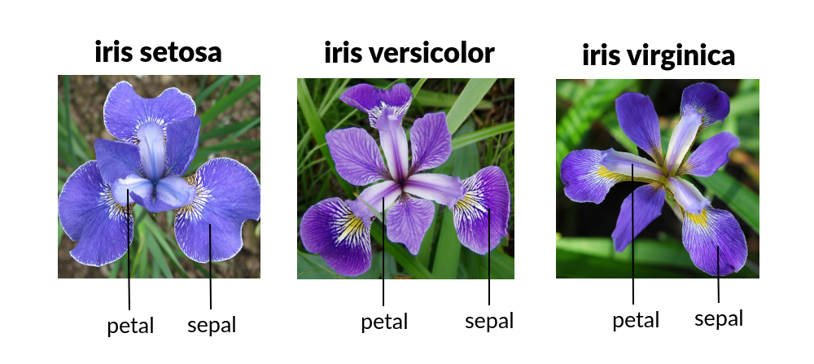

# Higher Diploma in Science in Computing - Data Analytics
******

## Programming and Scripting - Project Iris

This repository was created as part of the [Programming and Scripting](https://www.gmit.ie/programming-and-scripting) assessment module for the course in the [Higher Diploma in Data Analytics](https://www.gmit.ie/higher-diploma-in-science-in-computing-in-data-analytics?_gl=1*1bcdos0*_ga*MTE3OTU2MzQ5LjE2OTY2MDYwMzE.*_ga_5R02GBYV8V*MTcxNDMzOTE2Ni4xMS4xLjE3MTQzMzkyMDAuMC4wLjA.) at [ATU](https://www.atu.ie/). This README has been written with [Github's Documentation On READMEs](https://docs.github.com/en/repositories/managing-your-repositorys-settings-and-features/customizing-your-repository/about-readmes) in mind. [[1]](#1) This project is using the dataset [Iris](https://archive.ics.uci.edu/dataset/53/iris) to demonstrate the skills developed in the course in data analysis and visualization. [[2]](#2) You can find more about [writing in Mark Down in GitHub's documentation](https://docs.github.com/en/get-started/writing-on-github/getting-started-with-writing-and-formatting-on-github/basic-writing-and-formatting-syntax). [[3]](#3)

## About This Project

This project is about the [Iris](https://archive.ics.uci.edu/dataset/53/iris) dataset that contains 150 observations of three different species: Iris setosa, Iris virginica, and Iris versicolor, with 50 observations each.

Each observation consists of four features: sepal length (cm), sepal width (cm), petal length (cm), and petal width (cm).

## Use of This Project

This project is useful for demonstrating some of the skills developed for analysis, programming and data visualization using Python (.py), Jupyter Notebook (.ipynb) and ReadMe.md.

## Getting Started

I used [openincolab](https://openincolab.com/) to generate the following clickable link. It opens the [`analysisjn.ipynb`](https://github.com/RodrigoDMU/pands-project/blob/main/analysisjn.ipynb) Jupyter Notebook in [Google Colab](https://colab.research.google.com/).

## Licence

This dataset is licensed under a [Creative Commons Attribution 4.0 International](https://creativecommons.org/licenses/by/4.0/legalcode) (CC BY 4.0) license. This allows for the sharing and adaptation of the datasets for any purpose, provided that the appropriate credit is given.

**Data originally published in:**

Unwin, A., & Kleinman, K. (2021). The iris data set: In search of the source of virginica. Significance, 18. [[4]](#4)

## References

<a id="1">[1]</a> About READMEs. Availible in: https://docs.github.com/en/repositories/managing-your-repositorys-settings-and-features/customizing-your-repository/about-readmes. [Accessed 02 May 2024].

<a id="2">[2]</a> Iris dataset. Availible in: https://archive.ics.uci.edu/dataset/53/iris. [Accessed 02 May 2024].

<a id="3">[3]</a> Basic writing and formatting syntax. Availible in: https://docs.github.com/en/get-started/writing-on-github/getting-started-with-writing-and-formatting-on-github/basic-writing-and-formatting-syntax. [Accessed 02 May 2024].

<a id="4">[4]</a> The iris data set: In search of the source of virginica. Availible in: https://www.semanticscholar.org/paper/The-iris-data-set%3A-In-search-of-the-source-of-Unwin-Kleinman/4599862ea877863669a6a8e63a3c707a787d5d7e. [Accessed 02 May 2024].

## Author

**Rodrigo De Martino Ucedo:**
 I am currently studying Higher Diploma in Computing in Data Analytics at Atlantic Technological University. For more information or questions, please contact me on GitHub or add me on [LinkedIn](https://www.linkedin.com/in/rdmdemartino/).
*****
last commit on 20/05/2024